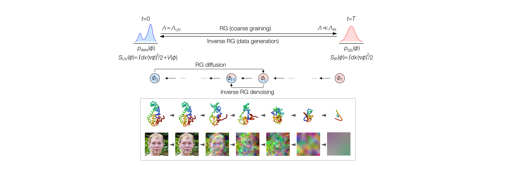

# Renormalization Group-based Diffusion Model (RGDM)



Implementation of [Generative Diffusion Model with Inverse Renormalization Group Flows](https://arxiv.org/abs/) by Kanta Masuki and Yuto Ashida.

Renormalization group-based diffusion model (RGDM) is a generative diffusion model based on the exact renormalization group, which leverages multiscale structures inherent in natural data, such as the protein structures and images. In this Github repository, we provide the Python codes used in the numerical experiments described in the paper. For their detailed usages, please refer to the readme files in each directory, i.e., `./protein_str_pred/README.md` and `./image_generation/README.md`.

Please contact kmasuki@g.ecc.u-tokyo.ac.jp with any comments or issues regarding this repository. 

To cite our work, please use, e.g., 
```
@misc{KY2025rgdm,
      title={Generative Diffusion Models with Inverse Renormalization Group Flows}, 
      author={Kanta Masuki and Yuto Ashida},
      year={2025},
      eprint={2501.xxxxx},
      archivePrefix={arXiv},
}
```
